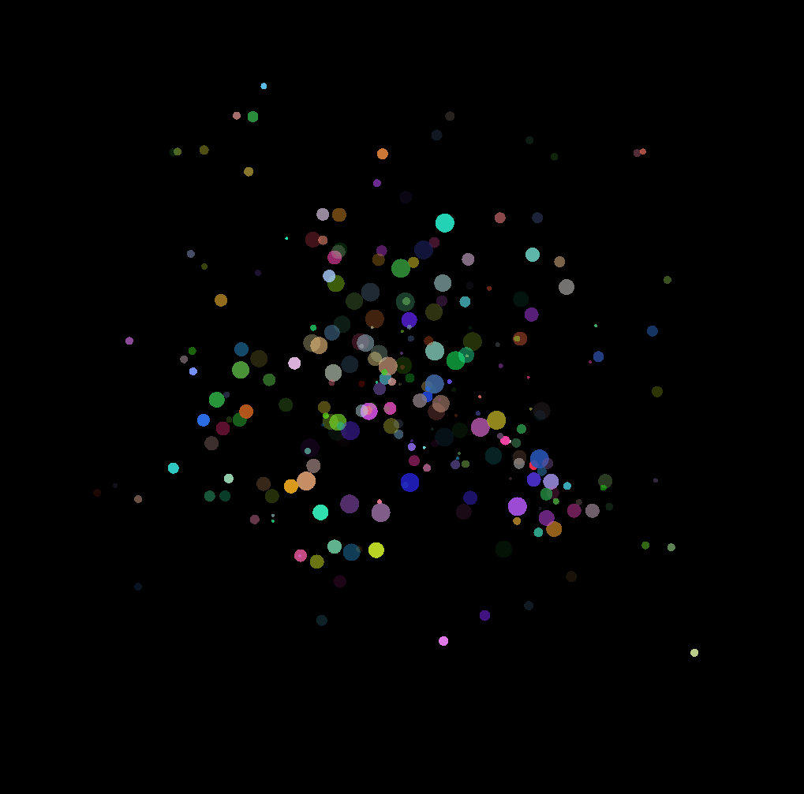
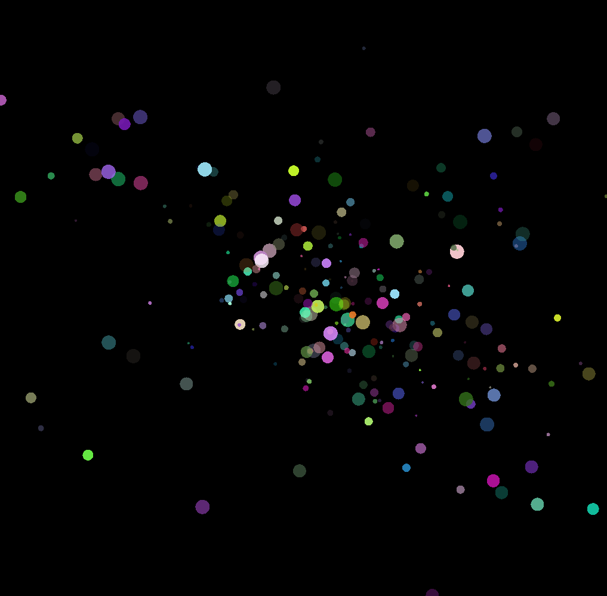

# sfml_particle_simulation
Quick and Dirty Particle Simulation using C++ and SFML.\
This Simulation has neither meaning in physics nor is it efficient...but it looks cool

# How to use:
To run the simultion you need to compile main.cpp first (run ./compiler to do that, you might need to make the compiler executable first with "chmod 777 compiler"). Compiling will create an executable which you can open with ./sfml-app

